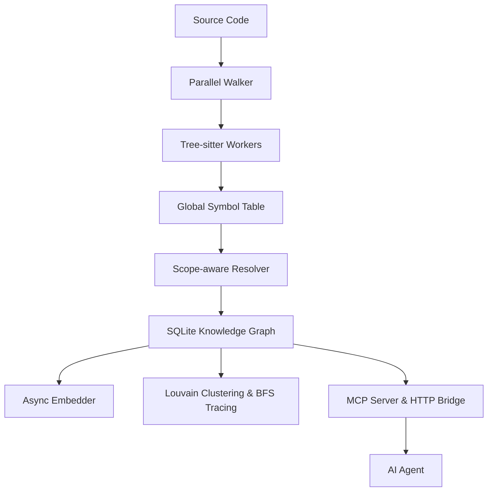

# Mimir Architecture

Mimir is a code intelligence engine designed to index source code into a high-fidelity knowledge graph and expose it to AI agents via the Model Context Protocol (MCP).

## High-Level Overview

## Core Components

### 1. Parallel Walker & Parser
The `internal/walker` package performs concurrent file enumeration while respecting `.gitignore`. The `internal/parser` package uses a pre-allocated pool of `tree-sitter` workers to extract symbols (Functions, Classes, Methods, etc.) without the overhead of re-creating parsers for every file.

### 2. Scope-aware Resolver
The `internal/resolver` performs a two-pass algorithm:
- **Pass 1**: Build a global Symbol Table (Trie-based) of all exported and internal symbols.
- **Pass 2**: Resolve call sites and references to their definitions across file boundaries, assigning confidence scores based on resolution certainty.

### 3. Knowledge Graph Store
Mimir uses SQLite (`modernc.org/sqlite`) with `sqlite-vec` for high-performance storage.
- **Nodes**: Symbols with metadata (file, line, exported status).
- **Edges**: Relationships (CALLS, IMPORTS, EXTENDS, IMPLEMENTS).
- **BM25**: Full-text search index.
- **Vector**: HNSW-based semantic search.

### 4. Analysis Engines
- **Community Detection**: Uses the Louvain algorithm to group related code into "clusters".
- **Process Tracing**: Uses BFS to identify end-to-end execution flows (processes) starting from entry points.

### 5. Transport Layer
- **MCP Server**: Implements the Model Context Protocol over stdio.
- **HTTP Bridge**: Exposes the knowledge graph via a REST API for remote integration.
